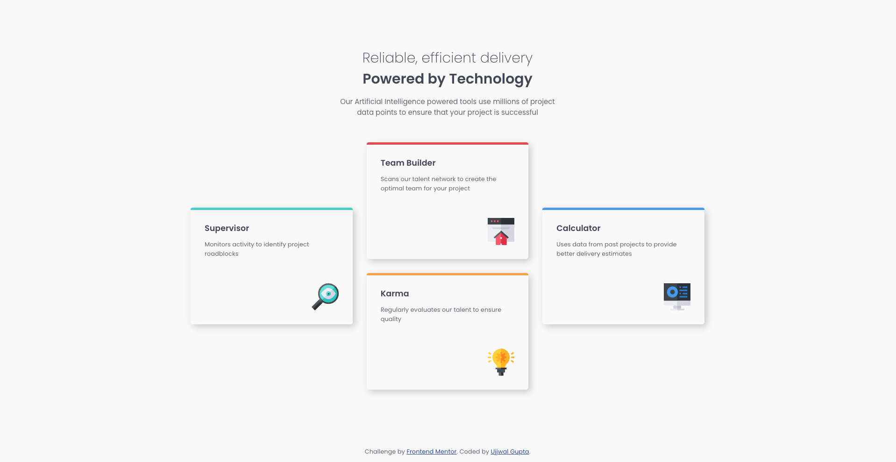

# Frontend Mentor - Four Card Feature Section solution

This is a solution to the [Four Card Feature Section challenge on Frontend Mentor](https://www.frontendmentor.io/challenges/four-card-feature-section-weK1eFYK). Frontend Mentor challenges help you improve your coding skills by building realistic projects. 

## Table of contents

- [Overview](#overview)
  - [The challenge](#the-challenge)
  - [Screenshot](#screenshot)
  - [Links](#links)
- [My process](#my-process)
  - [Built with](#built-with)
  - [What I learned](#what-i-learned)
  - [Continued development](#continued-development)
  - [Useful resources](#useful-resources)
- [Author](#author)
- [Acknowledgments](#acknowledgments)

## Overview

### The challenge

Users should be able to:

- View the optimal layout for the site depending on their device's screen size

### Screenshot

### Links

- Solution URL: [Code](https://github.com/guptaujjwal1128/product-preview-card-component)
- Live Site URL: [Live](https://guptaujjwal1128.github.io/product-preview-card-component)

## My process

### Built with

- Semantic HTML5 markup
- CSS custom properties
- Flexbox and Gridbox
- Mobile-first workflow
- Vanilla JS
- [Webpack](https://webpack.js.org) - Module Bundler

### What I learned
- responsive design art
- performance profiling using chrome dev tools
- font optimization basics   

### Continued development

 - responsive and pretty UI designing
 - SEO
 - Popular JS frameworks

### Useful resources

- [css-tricks](https://css-tricks.com) - This helped in discovering new approaches for designing responsive UI. Also, it is good reference for css properties.

## Author

- Website - [Ujjwal Gupta](https://my-ownportfolio.firebaseapp.com/contact)
- Frontend Mentor - [guptaujjwal1128](https://www.frontendmentor.io/profile/guptaujjwal1128)
- LinkedIn - [ujjwal-gupta-671588154](https://www.linkedin.com/in/ujjwal-gupta-671588154)

## Acknowledgments

FrontEnd Mentor Discord Community